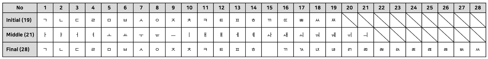
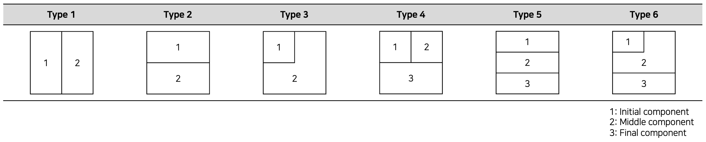
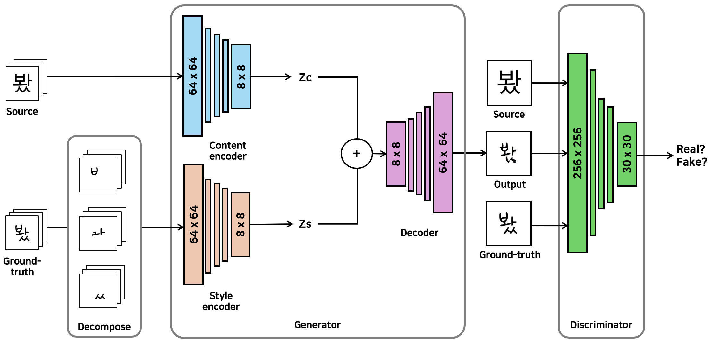
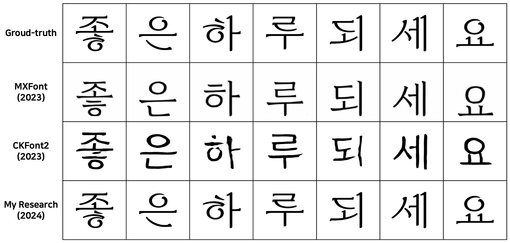

# Decompose

Location-based Hangul Component Separation for Accuracy Improvement of Korean Font Generation Model <br/>
한글 생성 모델의 정확도 향상을 위한 위치 기반 한글 구성요소 분리 <br/>
<a href='https://oasis.ssu.ac.kr/search/i-discovery/5262559?type=biblios-list-view'>Paper</a>

<br/>

## Introduction

Hangul consists of 19 initial consonants, 21 medial vowels, and 28 final consonants. The number of characters that can be made by combining all the components is 11,172. The 11,172 characters are combined into 6 types. This study separates components based on location from combined Korean font images and uses them as learning data. As a result, it was possible to achieve higher accuracy than existing Korean generation font models. <br/>
한글은 초성 19개, 중성 21개, 종성 28개로, 각 구성요소를 모두 조합하여 만들 수 있는 글자 수는 11,172자 이다. 11,172자는 6가지 유형으로 조합된다. 본 연구는 조합된 한글 폰트 이미지에서 위치 기반으로 구성요소를 분리하여 학습데이터로 사용한다. 결과적으로 기존 한글 폰트 생성 모델보다 높은 정확도를 달성할 수 있었다.

<br/>

<div align='center'> 

Table 1. Korean Components


<br/>

Table 2. Korean Combination Types


</div>

<br/>

## Architecture

<div align='center'>

Figure 1. Architecture Overview
</div>

<br/>

## Method 

<br/>

## Experiment

### Environment Setting

- M3 MacBook Pro macOS Sequoia
- Download and install <a href='https://www.anaconda.com/download'>Miniconda</a> package.

```
conda create -n torch-mps python=3.9
conda activate torch-mps
pip install torch torchvision
pip install opencv-python
pip install matplotlib
```

<br/>

Now, you can verify environment following commands.

```
import torch
x = torch.rand(5,3)
print(x)
```

<br/>

### Datasets

- Generate source images.
```
python datasets/font2img.py --txt_dir datasets/characters/50characters.txt --fonts_dir datasets/fonts/source --output_dir datasets/images/source --start_idx 0
```

<br/>

- Generate ground-truth images.

```
python datasets/font2img.py --txt_dir datasets/characters/50characters.txt --fonts_dir datasets/fonts/target --output_dir datasets/images/target --start_idx 1
```

<br/>

- Separate components.

```
python separate.py
```

<br/>

- Combine components.

```
python combine.py
```

<br/>

### Train

```
python main.py --mode train --epochs 1000 --output_dir trained_model 
```

<br/>

### Generate

```
python main.py --mode test --checkpoint trained_model
```

<br/>

## Result



<br/>

## References 

- <a href='https://docs.opencv.org/4.x/d3/db4/tutorial_py_watershed.html'>Opencv-python docs</a>